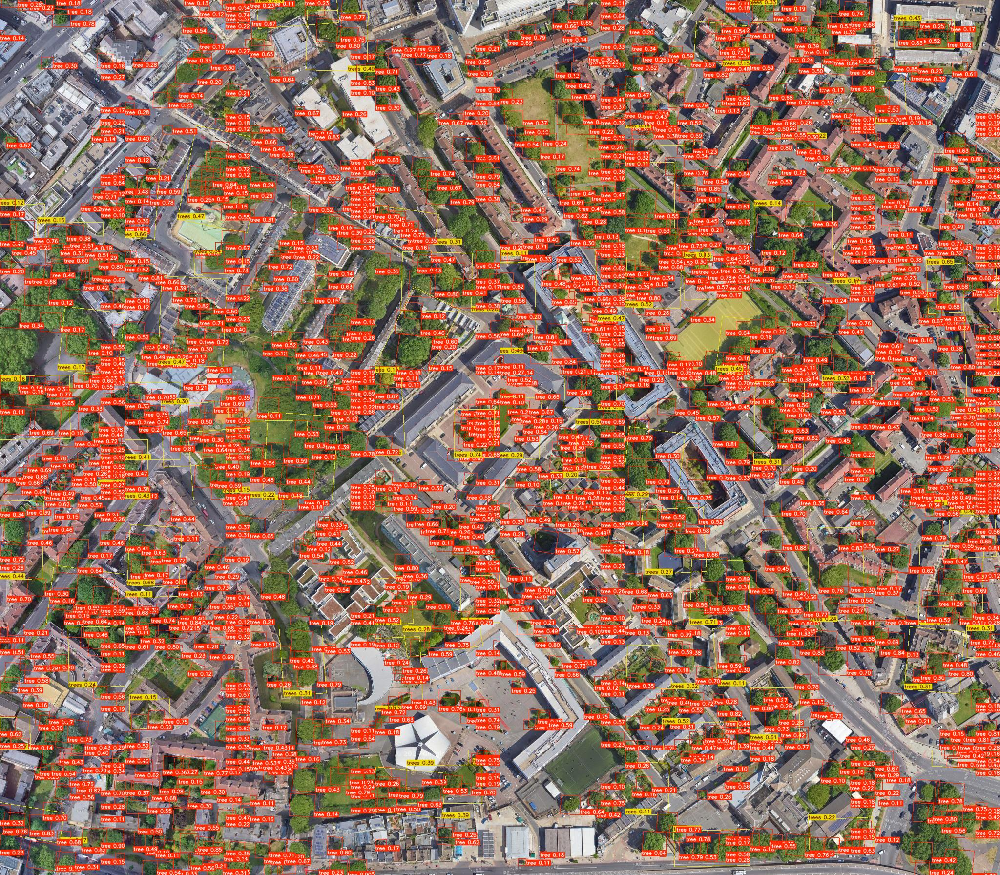

# Eco-Tree: Tree Detection and Analysis Web Application

Eco-Tree is a web-based application that uses advanced machine learning techniques to detect and analyze trees in satellite imagery or user-uploaded images. This project aims to provide valuable insights into tree coverage, density, and distribution, which can be crucial for environmental monitoring, urban planning, and conservation efforts.

## Features

- Interactive map for area selection
- Image upload for custom analysis
- Real-time tree detection using YOLOv8 object detection model
- Analysis of tree count, area covered, and tree density
- Visualization of results through charts and overlays
- Downloadable processed images
- Adjustable confidence threshold for fine-tuning detection

## Technology Stack

- Backend: Python with Flask
- Frontend: HTML, CSS, JavaScript
- Machine Learning: YOLOv8 (Ultralytics)
- Mapping: Leaflet.js
- Charting: Chart.js
- Styling: Bootstrap

## Installation

1. Clone the repository:
   ```
   git clone https://github.com/Sofin-AI/eco-tree.git
   cd eco-tree
   ```

2. Install the required Python packages:
   ```
   pip install -r requirements.txt
   ```

3. Set up the YOLO model:
   - Download the pre-trained YOLO model and place it in the appropriate directory (see `app.py` for the model path).

4. Run the application:
   ```
   python app.py
   ```

5. Open a web browser and navigate to `http://localhost:5000` to use the application.
   


 

## Usage

1. Use the interactive map to select an area for analysis, or upload an image using the provided form.
2. Adjust the confidence threshold if needed.
3. Click "Analyze Trees" or "Update Analysis" to process the selected area or image.
4. View the results, including tree count, area covered, and tree density.
5. Download the processed image or explore the visualizations.

## Project Structure

- `app.py`: Main Flask application file
- `static/`: Contains static files (CSS, JavaScript, images)
- `templates/`: Contains HTML templates
- `runs/`: Contains YOLO model configurations and weights

## Contributing

Contributions to Eco-Tree are welcome! Please feel free to submit a Pull Request.

## License

This project is licensed under the MIT License - see the LICENSE file for details.

## Acknowledgements

- [Ultralytics YOLOv8](https://github.com/ultralytics/ultralytics)
- [Leaflet.js](https://leafletjs.com/)
- [Chart.js](https://www.chartjs.org/)
- [Bootstrap](https://getbootstrap.com/)

